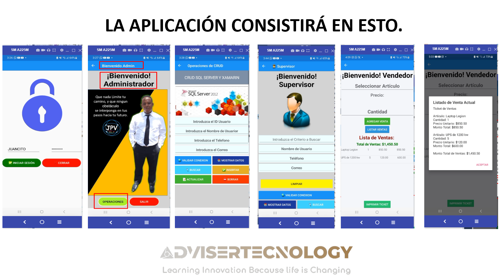
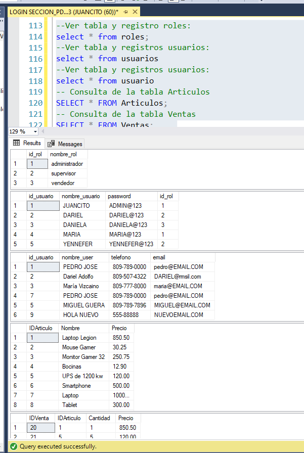

# PROYECTO CON XAMARIN,  C#,  SQL SERVER -CON USO DE CRUD -CREATE, READ, UPDATE, DELETE-CON LOGIN Y ROLES, MAS TABLAS, ARTICULOS Y VENTAS

## Introducción:
Introducción al desarrollado con Xamarin, C# y SQL Server. En este proyecto, exploraremos cómo construir una aplicación móvil funcional que permitirá a los usuarios registrar  usuarios, roles de usuarios, articulos, y ventas,  generar tickets, todo ello a través de una interfaz de usuario intuitiva y amigable.

## Objetivos Clave:

Crear una interfaz de usuario atractiva y fácil de usar que permita a los usuarios navegar y realizar acciones de manera intuitiva.
Implementar la lógica de negocio para registrar ventas y calcular montos totales automáticamente.
Conectar la aplicación a una base de datos SQL Server para almacenar información sobre artículos y ventas.
Desarrollar la funcionalidad de listar ventas y mostrar detalles relevantes.
Generar tickets de venta con información detallada y presentarla al usuario.
Proporcionar una experiencia de aprendizaje práctica en programación orientada a objetos, desarrollo móvil y manejo de bases de datos.

A medida que avancemos en este emocionante proyecto, exploraremos cómo los conceptos de programación orientada a objetos y el uso de herramientas como Xamarin y SQL Server se combinan para crear una aplicación móvil efectiva y funcional. Prepárate para sumergirte en la programación móvil y desarrollar tus habilidades en un entorno práctico y divertido. ¡Vamos a comenzar a construir nuestra aplicación de ventas y a aprender juntos en este emocionante viaje de desarrollo!

# CAPTURAS DE PANTALLA:

# BASE DE DATOS:

## ¡No olvides suscribirte, compartir el video, darle like y dejar tus comentarios en la sección de abajo. ¡Tu apoyo es muy importante para mí y me ayudas a seguir creando contenido. 💚

- 🎬 **YouTube:** [Juancito Peña V](https://www.youtube.com/@JuancitoPenaV)
- 👨‍💼 **LinkedIn:** [Juancito Peña](https://www.linkedin.com/in/juancitope%C3%B1a/)
- 📰 **Blog:** [Adviser Tecnology](https://advisertecnology.com/)
- 📷 **Instagram:** [juancito.pena.v](https://www.instagram.com/juancito.pena.v/)
- 📑 **Facebook:** [Juancito Pena V](https://www.facebook.com/juancito.p.v)
- 🐦 **Twitter:** [Juancito Peña V](https://twitter.com/JuancitoPenaV)
